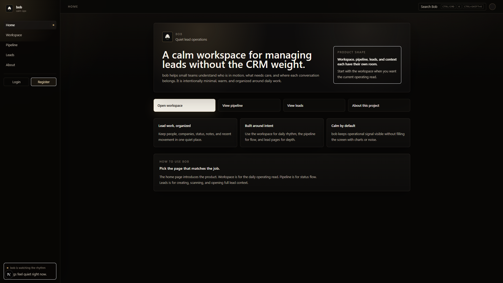
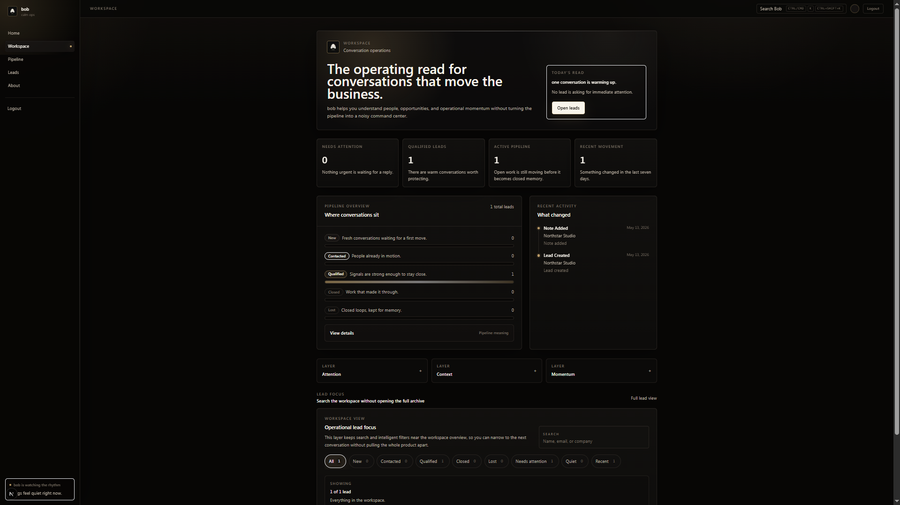
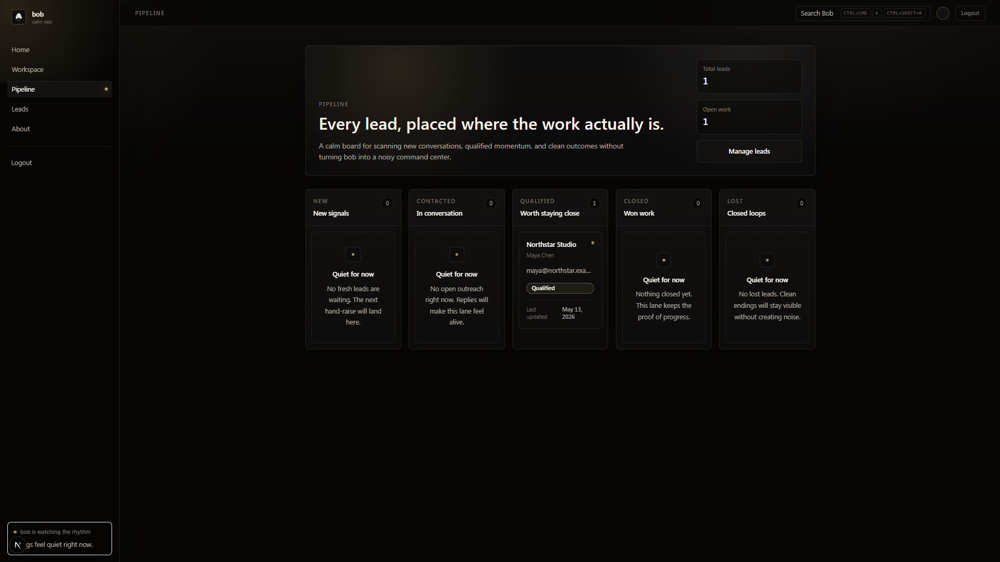
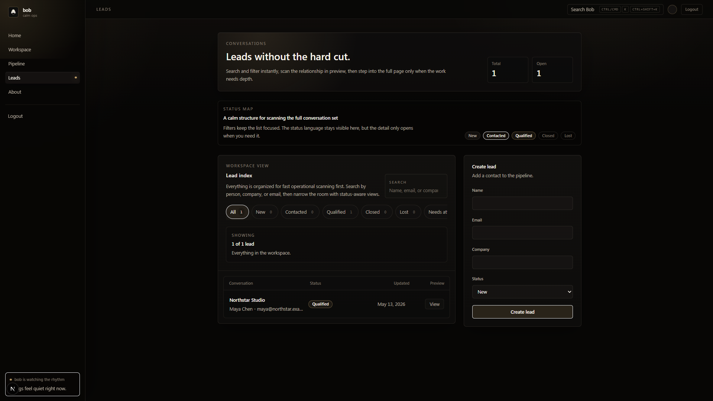
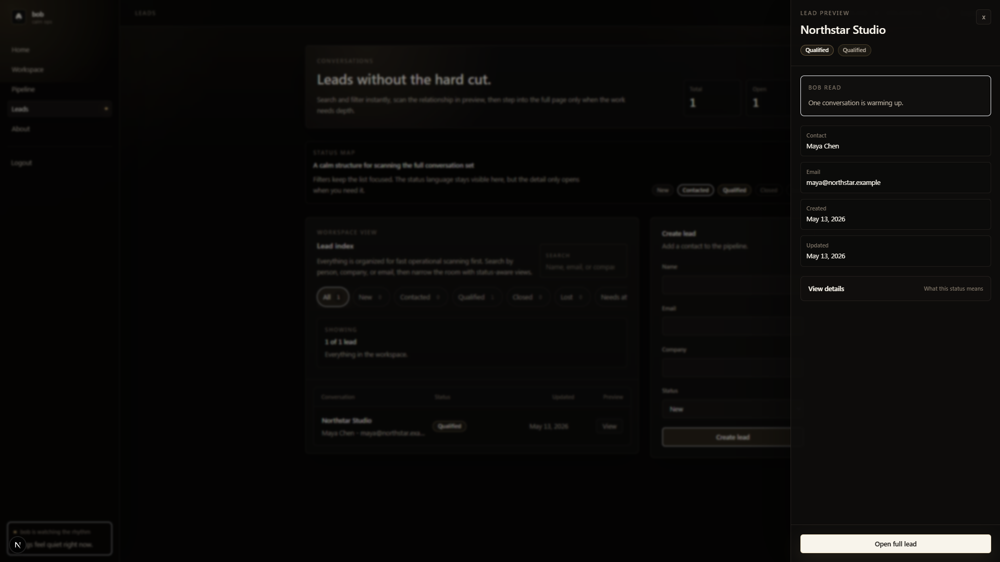
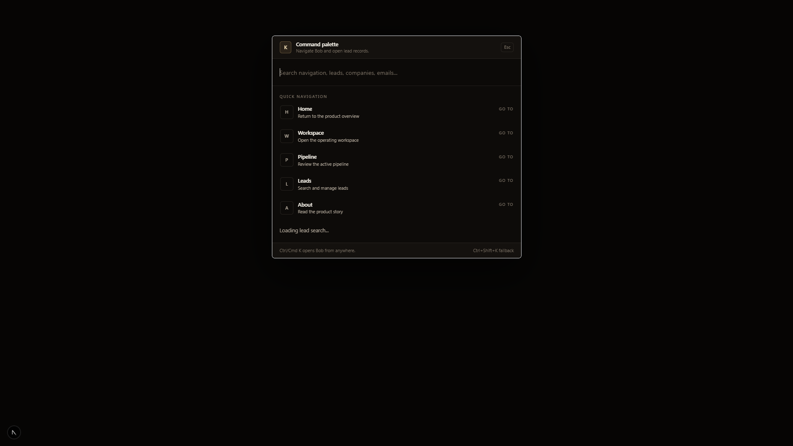
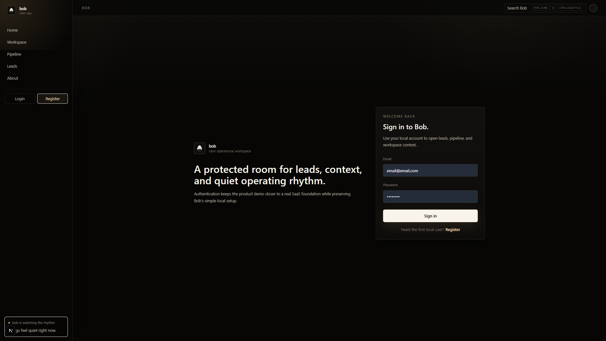
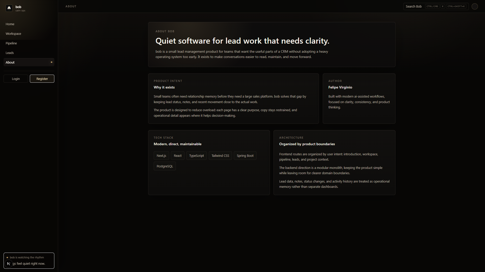

# bob

<p align="left">
  
</p>

bob is a calm fullstack workspace for lead management, business workflows, and contextual intelligence.

It is built like a real SaaS product: separated frontend and backend, authentication, protected operational routes, PostgreSQL persistence, CI, smoke tests, documentation, and a UI that tries to make daily lead work feel clear instead of noisy.

Portuguese version: [README-pt-BR.md](README-pt-BR.md)

## what it is

bob is an operational workspace for people who need to track leads without fighting a heavy CRM.

The product brings lead records, filters, contextual search, a kanban pipeline, lead details, notes, activity history, follow-up scheduling, an attention queue, quick actions, and a command palette into one focused interface. It is not trying to be every sales tool at once. The idea is simpler: show what is happening, what needs attention, and where the next action should happen.

For recruiters, bob is a portfolio project with real product thinking. For tech leads, it is a fullstack codebase with clear boundaries, pragmatic architecture, and room to grow without pretending that future infrastructure already exists.

## why it exists

Most operational tools become complex before the workflow is even clear.

bob starts from the workflow:

- leads should be easy to scan
- status should be visible without opening every record
- details should appear when they help, not before
- search and filters should support the way people actually work
- the codebase should stay understandable as features are added

This project is also a public record of how I build: product first, architecture with purpose, small decisions documented, and a roadmap that separates what is implemented from what is still planned.

## product preview / screenshots

Screenshots were captured from local development. Production validation is still pending because the Railway environment had external instability during this pass.

| Home | Workspace |
| --- | --- |
|  |  |

| Pipeline | Leads |
| --- | --- |
|  |  |

| Lead preview | Command palette |
| --- | --- |
|  |  |

| Login | About |
| --- | --- |
|  |  |

## main features

Implemented today:

- lead management with create, list, detail, update, and status change flows
- kanban pipeline grouped by lead status
- lead detail actions, notes, and activity history
- follow-up scheduling on lead create and edit flows
- workspace attention queue for overdue and due-today follow-ups
- Bob read: backend-only AI lead summary, operational read, next action, and attention signal, with follow-up timing included in the prompt context
- lead intelligence signals such as recent, quiet, and needs-attention views
- intelligent filters and contextual search across lead data
- command palette for quick navigation and product actions
- lateral drawer for lead preview and progressive disclosure
- login, register, current-user, and logout flow
- Spring Security with JWT authentication
- protected operational routes in the frontend
- protected backend APIs for operational data
- PostgreSQL persistence with Flyway migrations
- Docker Compose local database
- GitHub Actions CI
- Playwright smoke tests
- documentation for architecture, roadmap, product direction, brand, and engineering decisions

## tech stack

| Area | Current technology |
| --- | --- |
| Frontend | Next.js 15, React 19, TypeScript, Tailwind CSS |
| Backend | Java 21, Spring Boot 3.3, Spring Web, Spring Security, Spring Data JPA, Bean Validation |
| Database | PostgreSQL 16, Flyway |
| Local infrastructure | Docker Compose |
| Quality | Maven tests, Spring Boot tests, ESLint, Next.js build, Playwright smoke tests, GitHub Actions |

Redis, RabbitMQ, Prometheus, Grafana, OpenTelemetry, AWS RDS, AWS ECS/EKS, Terraform, and Kubernetes are roadmap items. They are not part of the current implementation.

## architecture

bob uses a separated frontend/backend architecture:

```text
Next.js frontend
  -> typed API access in frontend/lib
  -> Spring Boot REST API
  -> Spring Data JPA
  -> PostgreSQL
```

The backend is a modular monolith. That is intentional. For this stage, a single deployable backend keeps development, transactions, and local setup simple while still allowing the code to grow around clear internal modules.

Current backend areas:

- `modules/auth`: registration, login, current-user lookup, BCrypt password hashing, JWT issuing
- `modules/leads`: lead workflow, follow-up dates, attention queue, notes, activity history, status transitions, and persisted lead AI insights
- `modules/ai`: OpenAI-backed insight generation client and AI configuration
- `modules/system`: application status
- `shared/api`: API errors and exception handling
- `config`: security and application configuration

The frontend uses the Next.js App Router, reusable product components, and a small API layer. The UI is built around operational UX: fast scanning, low visual noise, clear status, and actions close to the lead context.

More detail: [docs/architecture.md](docs/architecture.md)

## engineering decisions

Some choices in bob are deliberately boring, because boring is often what lets a product move:

- The backend starts as a modular monolith instead of premature microservices.
- PostgreSQL is the source of truth.
- Flyway owns schema changes.
- JWT auth protects operational routes without introducing session infrastructure yet.
- The frontend talks to the backend through API helpers, not direct database access.
- The UI uses progressive disclosure so the workspace does not become a wall of controls.
- CI checks backend tests, frontend lint/build, and Playwright smoke coverage.
- Future infrastructure is documented, but not added before the product needs it.

More detail: [docs/engineering-decisions.md](docs/engineering-decisions.md)

## local setup

Prerequisites:

- Java 21
- Maven Wrapper included in `backend`
- Node.js and npm
- Docker Compose

Start PostgreSQL from the repository root:

```bash
docker compose up -d
```

Run the backend:

```bash
cd backend
./mvnw spring-boot:run
```

Run the frontend:

```bash
cd frontend
npm install
cp .env.example .env.local
npm run dev
```

Set the frontend API origin:

```bash
NEXT_PUBLIC_API_BASE_URL=http://localhost:8080
```

Useful backend checks:

```bash
curl http://localhost:8080/actuator/health
curl http://localhost:8080/api/status
```

Production recovery and deployment troubleshooting:
[docs/production-recovery.md](docs/production-recovery.md)

Oracle Cloud Always Free deployment foundation:
[docs/oracle-deployment.md](docs/oracle-deployment.md)

## authentication

bob has local authentication implemented.

Current auth flow:

- users can register
- users can log in
- the backend issues a JWT
- protected frontend routes check authentication
- protected backend APIs require a bearer token
- users can log out from the frontend

Local auth values:

```bash
BOB_AUTH_JWT_SECRET=local-development-secret-change-me-please-32
BOB_AUTH_JWT_EXPIRATION_MINUTES=480
```

The default JWT secret is only for local development. Use a strong secret outside local demos.

## AI insights

Bob's first AI-assisted workflow is the lead detail "Bob read". It is generated only after an authenticated user asks for it and includes a short summary, operational read, suggested next action, and attention signal when relevant.

The current product flow is deliberately simple: a lead can carry a next follow-up date, overdue and due-today follow-ups appear in the workspace attention queue, and Bob read uses that follow-up state as context when generating its operational read. AI does not schedule, clear, or update follow-ups for the user.

The OpenAI API key stays backend-only. The frontend calls Bob's backend, and the backend calls OpenAI. If AI is disabled, `OPENAI_API_KEY` is missing, or `BOB_AI_MODEL` is missing, the API returns an unavailable state instead of pretending an insight was generated.

Default local and CI setup runs without AI:

```bash
BOB_AI_ENABLED=false
BOB_AI_MODEL=
OPENAI_API_KEY=
```

To enable AI locally, set backend environment variables and restart the backend:

```bash
BOB_AI_ENABLED=true
BOB_AI_MODEL=<model-available-to-your-openai-account>
OPENAI_API_KEY=<your-openai-api-key>
```

Never commit real API keys, never expose OpenAI keys with `NEXT_PUBLIC_` variables, and use different secrets for local, dev, and production environments. `BOB_AI_MODEL` must be set to a model available to your OpenAI account.

For local-only provider diagnostics, set `BOB_AI_DEBUG_RESPONSE_SHAPE=true` temporarily. It is `false` by default and must stay disabled in CI, dev, and production; normal logs include only safe response shape metadata.

AI in Bob is assistive, not autonomous. It does not change lead data or take actions for the user, and the output should not be treated as final business truth. If AI stays disabled, Bob still works normally; saved insights may still display if they were generated earlier.

Create the first local user in the browser:

```text
http://localhost:3000/register
```

Or call the backend directly:

```bash
curl -X POST http://localhost:8080/api/auth/register \
  -H "Content-Type: application/json" \
  -d '{"name":"Local User","email":"local@example.com","password":"password123"}'
```

## tests and ci

Backend:

```bash
cd backend
./mvnw test
```

Frontend:

```bash
cd frontend
npm run lint
npm run build
npm run test:e2e
```

GitHub Actions runs backend and frontend validation on pull requests. Playwright smoke tests cover the first browser-level checks for public pages, auth pages, protected redirects, and command palette behavior.

## roadmap

Near-term product work:

- workspace ownership
- lead ownership
- richer lead actions
- saved views for common operational filters
- stronger command palette behavior for navigation and lead actions
- richer contextual search across notes and activity history
- import flow for lead lists
- role-aware access rules
- refresh tokens, password reset, email verification, and invite flow

Future intelligence work:

- richer insight history and quality feedback
- stale lead detection
- short follow-up draft support

Future infrastructure, only when justified:

- Redis
- RabbitMQ
- Prometheus and Grafana
- OpenTelemetry
- AWS RDS
- AWS ECS/EKS
- Terraform
- Kubernetes

More detail: [docs/roadmap.md](docs/roadmap.md)

## why this project matters

bob matters because it is not just a CRUD with a nicer coat of paint.

The project connects product decisions, operational UX, backend architecture, authentication, testing, documentation, and roadmap discipline in one place. It shows how a SaaS-style product can start small and still be built with the habits that make larger systems easier to reason about later.

The current version is still evolving, but the direction is clear: a calm workspace for lead operations, built with enough technical structure to keep improving without collapsing under its own complexity.

## author

Built by Felipe Virginio.

Product engineer and backend-focused fullstack builder.

More docs:

- [Architecture](docs/architecture.md)
- [Engineering decisions](docs/engineering-decisions.md)
- [Oracle deployment](docs/oracle-deployment.md)
- [Product direction](docs/product.md)
- [Roadmap](docs/roadmap.md)
- [Brand notes](docs/brand.md)
